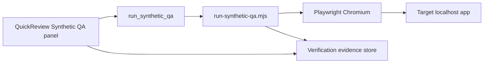

# Synthetic user QA — first loop (prototype)

Product brief for the smallest CodeVetter workflow that exercises a changed web surface and stores evidence next to review findings.

## Target repo / app input

| Field | First loop value |
|-------|------------------|
| **Target app** | CodeVetter desktop Vite shell (`apps/desktop`) |
| **Base URL** | `http://localhost:1420` (user must run `npm run dev` in `apps/desktop`) |
| **Route** | `/review` |
| **Loop id** | `codevetter-review-shell` |
| **Changed surface** | Review page shell after UI/layout work on `/review` |

Future loops will take `baseUrl` + `route` from the reviewed repo (detected via Repo Unpacked / `playwright.config.ts`). This prototype hard-codes the CodeVetter self-check so we can dogfood the pipeline.

## User goal

> As a developer who changed the Review UI, confirm a real browser can open `/review`, render the page heading, and finish without unexpected console errors — without manually clicking through the app.

## Browser / test runner path

1. User opens a past review in **Review → view mode** (or stays on the review result).
2. In **Synthetic user QA**, leaves base URL at `http://localhost:1420` and runs **Run QA loop**.
3. Tauri command `run_synthetic_qa` spawns `apps/desktop/scripts/run-synthetic-qa.mjs` with Playwright (Chromium).
4. Script navigates to `{baseUrl}/review`, waits for `main`, asserts `h1` contains `Review`, collects console errors, captures screenshot on failure.
5. JSON result returns to the webview; **Apply to selected finding** maps it into **Verification evidence** (level `browser`, status `reproduced` or `not_reproduced`, artifact path, QA notes).

CLI-only (no UI):

```bash
cd apps/desktop
npm run dev   # separate terminal
npm run synthetic-qa:run
```

## Evidence captured

| Artifact | Location | Purpose |
|----------|----------|---------|
| Pass/fail + step notes | `SyntheticQaRunResult.notes` | Human-readable QA log |
| Screenshot (on failure) | `{app_data}/synthetic-qa/<run_id>/failure.png` | Visual proof |
| Trace metadata | `SyntheticQaRunResult.trace` | URL, title, console errors, duration |
| Loop metadata | `loop_id`, `route`, `goal` | Repro context |

Evidence is **not** a separate dashboard. It lands in the existing **Verification evidence** block on QuickReview (same persistence key as manual evidence: `quick_review_evidence_{review_id}`).

## What becomes a finding

| Outcome | Finding behavior |
|---------|------------------|
| **Loop pass** | No new finding. Optional: mark selected finding evidence as `not_reproduced` if user was verifying a UI suspicion. |
| **Loop fail** | **Apply to selected finding** sets evidence to `browser` + `reproduced` with notes and screenshot path. User can also **Add QA finding** — inserts a `warning` finding titled from the loop goal with summary = failure notes (handoff/export includes it). |
| **Runner error** (dev server down, Playwright missing) | Shown inline; no finding. Recorded as operational failure, not app bug. |

Static review findings stay separate; synthetic QA only **elevates** or **refutes** them via evidence level/status.

## Unsupported app types (follow-up)

| App type | Status | Follow-up |
|----------|--------|-----------|
| Local Vite/React (HTTP) | **Supported** (first loop) | — |
| Tauri webview-only (no HTTP server) | Not supported | Detect `tauri dev` URL or drive WebDriver |
| Native mobile | Not supported | Maestro / XCTest bridge |
| CLI-only repos | Not supported | Command-runner evidence (`test` level) |
| Production HTTPS behind auth | Not supported | Cookie/fixture injection in loop defs |
| Packaged app without Node/Playwright | Not supported | Bundle Playwright or Rust headless WebView |

Track these in SaaS Maker under project `codevetter` when prioritising the next loop.

## Architecture (prototype)



## Related code

- `apps/desktop/scripts/run-synthetic-qa.mjs` — runner
- `apps/desktop/src/lib/synthetic-qa/` — loop defs + evidence mapping
- `apps/desktop/src-tauri/src/commands/synthetic_qa.rs` — Tauri entry
- `apps/desktop/src/pages/QuickReview.tsx` — UI + handoff
- `apps/desktop/tests/e2e/evidence.spec.ts` — manual evidence persistence (existing)